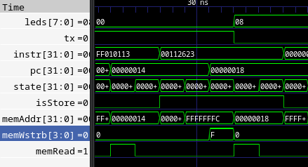

Rust on a tiny RISC-V
=====================

I was going through the fantastic ["From Blinker to RISC-V"][tutorial], making a 
functional RISC-V RV32I processor from scratch, when I got to step 20, "Using 
the GNU toolchain to compile programs - assembly". I looked ahead and saw the 
tutorial continues on to C, and thought, hey, why not Rust instead? And that's 
what we're doing here: compiling Rust programs for an incredibly tiny, 
incredibly simple RISC-V processor. So let's start! I'm using the small, poorly 
written, possibly buggy RISC-V I had from the tutorial (at step 20) here for 
testing - feel free to substitute your own. It has no interrupts, shared 
program/data memory (1 whole kiB), and has CSR instruction support.

This is *not* a tutorial for just getting going as quickly as possible. I'll be 
reconstructing a runtime environment for Rust from scratch, and stumbling around 
along the way. If you want to know everything that goes into making a runtime, 
this is the tutorial for you.

As a note, before we begin, I'm taking a lot of knowledge and code from the 
[`riscv-rt`][riscv_rt] crate, which does everything I'm doing here and more 
besides. One key difference though - we'll be using Rust's `global_asm!` and 
`asm!` macros to avoid some (but not all) of the annoyances of needing assembly 
initializer code. There are a few other deviations I make from `riscv-rt` 
besides that, which I'll point out as I make them.

[tutorial]: https://github.com/BrunoLevy/learn-fpga/tree/master/FemtoRV/TUTORIALS/FROM_BLINKER_TO_RISCV
[riscv_rt]: https://docs.rs/riscv-rt/latest/riscv_rt/

Step 1: Setup for cross-compilation
-----------------------------------

It's a safe bet you're not compiling for RV32I from a RV32I, so step 1 for us is 
setting up to cross-compile. This is actually pretty easy, thanks to 
[`rustup`](https://rustup.rs/). Just add our target with rustup like so:

```sh
rustup target add riscv32i-unknown-none-elf
```

And when we create our new binary with cargo, we mark the build target by 
creating the file `.cargo/config.toml` and putting in:

```toml
target = "riscv32i-unknown-none-elf"
```

That's it! We should be good to start cross-compiling. Let's see how that goes!

Step 2: Make Compilation Succeed
--------------------------------

Well, if we try `cargo build -r` with the basic "hello world" program, that 
immediately fails:

```
error[E0463]: can't find crate for `std`
  |
  = note: the `riscv32i-unknown-none-elf` target may not support the standard library
  = note: `std` is required by `femto_riscv_demo` because it does not declare `#![no_std]`

error: cannot find macro `println` in this scope
 --> src/main.rs:2:5
  |
2 |     println!("Hello, world!");
  |     ^^^^^^^

error: `#[panic_handler]` function required, but not found
```

Ah, right, we don't have a standard library here in bare-metal land. So let's 
take that `#![no_std]` marker mentioned in the error message and put it in the 
program, and get rid of `println` while we're at it. Now our program is 
literally just:

```rust
#![no_std]

fn main() { }
```

And...it fails, but with only one error now:

```
error: `#[panic_handler]` function required, but not found
```

Ok, we need a "panic handler". What's that? Well, whenever Rust hits a an error 
like a bounds check failure, or whenever you call `panic!()`, it needs a 
function to call with the panic info. We can write one ourselves, the simplest 
one possible: an empty loop that never ends:

```rust
#[panic_handler]
fn panic(_: &core::panic::PanicInfo) -> ! {
    loop {}
}
```

The panic handler's function signature is simple - take in info collected as 
part of the panic (which we'll ignore), and the ! means it must never return 
(because our program must halt in this function). So with that put in, do we 
compile now? ...Nope!

```
error: requires `start` lang_item
```

Hmm...ok, so, we need a `start` function if this is going to compile. Turns out, 
when you're baremetal, nothing is guaranteed, not even getting to `main`. 
`start` is the very-very first instruction the processor will run, and we need 
to provide it. So, let's do away with `main` and put in a specially marked 
`start` instead. Now the program looks like:

```rust
#![no_std]
#![no_main]

#[panic_handler]
fn panic(_: &core::panic::PanicInfo) -> ! {
    loop {}
}

#[no_mangle]
pub extern "C" fn start() -> ! {
    panic!()
}
```

So, we told the compiler we no longer have a `main` with `#![no_main]`, we 
marked it as a C ABI-compatible function with `extern "C"`, and told Rust to not 
mess with the name by adding `#[no_mangle]`. Does it compile now? Yes! So let's 
check the content using llvm-objdump and see what we've got:

```objdump
llvm-objdump -h target/riscv32i-unknown-none-elf/release/femto-riscv-demo

target/riscv32i-unknown-none-elf/release/femto-riscv-demo:      file format elf32-littleriscv

Sections:
Idx Name              Size     VMA      Type
  0                   00000000 00000000
  1 .eh_frame         00000018 00010094 DATA
  2 .riscv.attributes 0000001c 00000000
  3 .debug_abbrev     00000ece 00000000 DEBUG
  4 .debug_info       0002333e 00000000 DEBUG
  5 .debug_aranges    00001b88 00000000 DEBUG
  6 .debug_ranges     0000d728 00000000 DEBUG
  7 .debug_str        000376a2 00000000 DEBUG
  8 .debug_pubnames   000122ce 00000000 DEBUG
  9 .debug_pubtypes   000001d4 00000000 DEBUG
 10 .debug_line       0002771a 00000000 DEBUG
 11 .comment          00000013 00000000
 12 .symtab           00015260 00000000
 13 .shstrtab         000000ae 00000000
 14 .strtab           00000594 00000000
```

...well, it compiled! Looks like there's no code though (there'd be a TEXT Type
section somewhere if there was). This is all debug and data, no code to speak 
of. And if we used the `-d` flag instead of `-h`, llvm-objdump would also show 
no disassembly. Well, hey, at least it compiles! That's progress!

Step 3: Adding a Linker Script
------------------------------

To actually make something stick, it's time to get arcane and tell Rust more 
about our processor's memory layout and where we want the code to be. That means 
we need... a linker script. The linker is responsible for linking together all 
our bits of code and data and ordering it all up correctly in memory. It can't 
really do that if we haven't told it anything about our processor's memory or 
where things should go, yah? So let's do that.

Our linker script starts off by declaring the memory available. My little 
processor only has a measly 1 kiB of memory to its name:

```
MEMORY
{
  BRAM (RWX) : ORIGIN = 0x0000, LENGTH = 0x0800  /* 1kiB RAM */
}
```

Here, we've declared the "MEMORY" section of our script, where each line item is 
a section of memory in the processor's address space. We call it "BRAM", though 
any name is accepted, put RWX to mark it as read-write-execute, state the base 
address (or ORIGIN) as 0, and the total LENGTH as 1 kiB, or 0x0800 in hex.

As another example, maybe you've already split things up into ROM and RAM, and 
have, say, 4 kiB for each of those. Easy enough, we just add another line item, 
mark them appropriately, and set the ORIGIN and LENGTH correctly:

```
MEMORY
{
  ROM (RX) : ORIGIN = 0x0000, LENGTH = 4K
  RAM (RW) : ORIGIN = 0x1000, LENGTH = 4K
}
```

Look, we can even use shorthand and call the length 4K.

Anyway, memory declared. Now we need to tell the linker where to put the code. 
We do this with "SECTIONS". Code is, for historical reasons or whatever, called 
".text". We thus:

1. Declare a ".text" section
2. Tell it to KEEP anything matching `*(.init)`, which will put in a section 
	called `.init` at the top of the code, ensuring it executes first.
3. Realign to a 4-byte boundary (which would matter if we had compressed 
	instructions or something in our start function).
4. Put in any remaining text sections with `*(.text .text.*);`
5. Take this bundled-up section and stick it in BRAM. It's the first section 
	we've declared, so it gets to go in at the top of BRAM.

```
SECTIONS
{
	.text :
  {
    KEEP(*(.init));
    . = ALIGN(4);
    *(.text .text.*);
  }
  > BRAM
}
```

You may be thinking, "hey, there's more than just code in a program file. What 
about read-only data, and global variables, and the stack, and the heap, and so 
on?" Well, right now we're just trying to run a loop forever, thanks, so we 
don't need any of that yet. We'll get more than just code eventually, let's take 
it nice and slow.

Anyway, at this point, we need to change how we've marked up our start function. It 
should now look like this instead:

```rust
#[link_section = ".init"]
#[export_name = "_start"]
pub extern "C" fn start() -> ! {
    panic!()
}
```

We've marked the linker section we want it in, and we've forced Rust to set the 
name to _start when it gets exported as compiled code for the linker. This 
replaces `no_mangle` by making it so we don't care what we call it internally - 
it's going to be "_start" and that's that.

Whew, OK, so we've got our linker script, which I'm going to call "linker.ld" 
and put in the root folder of the crate. Now how do we make Rust actually use 
it? We're going to need a build.rs file to tell Rust where it is, where to copy 
it, and that it's part of the build process and thus we need to rebuild if it 
changes. So, make a build.rs in the root of your crate folder and stick this in:

```rust
use std::env;
use std::fs;
use std::path::PathBuf;

fn main() {
    let out_dir = PathBuf::from(env::var("OUT_DIR").unwrap());

    // Put the linker script somewhere the linker can find it.
    fs::write(out_dir.join("linker.ld"), include_bytes!("linker.ld")).unwrap();
    println!("cargo:rustc-link-search={}", out_dir.display());
    println!("cargo:rerun-if-changed=linker.ld");

    println!("cargo:rerun-if-changed=build.rs");
}
```

We still need to make the linker use the script though, and that requires we add 
another section to that .cargo/config.toml file:

```toml
[target.riscv32i-unknown-none-elf]
rustflags = ["-C", "link-arg=-Tlinker.ld"]
```

This tells cargo that when running, we pass an argument to rustc, and that 
argument is an argument it will pass to the linker, and *that*
argument is `-Tlinker.ld`, which means "Use the script linker.ld when linking, 
please."

Ok, cool, linker script in, it should be used, and the start function has been 
marked up. The build completes, let's look at the object file:

```objdump
target/riscv32i-unknown-none-elf/release/femto-riscv-demo:      file format elf32-littleriscv

Sections:
Idx Name                                                Size     VMA      Type
  0                                                     00000000 00000000
  1 .text                                               000000c4 00000000 TEXT
  2 .rodata..Lanon.fc0a1066aa4fa77f512f6c4b34f043aa.0   0000000e 000000c4 DATA
  3 .rodata..Lanon.fc0a1066aa4fa77f512f6c4b34f043aa.1   0000000b 000000d2 DATA
  4 .rodata..Lanon.fc0a1066aa4fa77f512f6c4b34f043aa.2   00000010 000000e0 DATA
  5 .rodata..Lanon.70a4e2c603b3c5e600a4a08141e4d272.2   00000000 000000f0 DATA
  6 .rodata..Lanon.70a4e2c603b3c5e600a4a08141e4d272.232 00000010 000000f0 DATA
  7 .eh_frame                                           00000070 00000100 DATA
  8 .riscv.attributes                                   0000001c 00000000
  9 .debug_abbrev                                       00000ece 00000000 DEBUG
 10 .debug_info                                         0002333e 00000000 DEBUG
 11 .debug_aranges                                      00001b88 00000000 DEBUG
 12 .debug_ranges                                       0000d728 00000000 DEBUG
 13 .debug_str                                          000376a2 00000000 DEBUG
 14 .debug_pubnames                                     000122ce 00000000 DEBUG
 15 .debug_pubtypes                                     000001d4 00000000 DEBUG
 16 .debug_line                                         0002771a 00000000 DEBUG
 17 .comment                                            00000013 00000000
 18 .symtab                                             00015580 00000000
 19 .shstrtab                                           000001b0 00000000
 20 .strtab                                             000007af 00000000
```

Hey, look at that, a TEXT section! And it starts with `<_start>` if I look at 
the disassembly with `-d`:

```objdump
Disassembly of section .text:

00000000 <_start>:
       0: 37 05 00 00   lui     a0, 0
       4: 13 05 45 0c   addi    a0, a0, 196
       8: b7 05 00 00   lui     a1, 0
       c: 13 86 05 0e   addi    a2, a1, 224
      10: 93 05 e0 00   li      a1, 14
      14: 97 00 00 00   auipc   ra, 0
      18: e7 80 80 02   jalr    40(ra)
      1c: 73 10 00 c0   unimp

... lots more after here ...
```

There's a bunch more code stuck in afterwards. I wonder if we can shrink that at 
all? Well... first, let's try putting this into the RISC-V and running it! How 
do we do that?

Step 4: Loading the program
---------------------------

So, I was all set to say it's easy - just use objcopy to convert the compiled 
file (an ELF file) into the verilog memory format, buuuuut alas, that doesn't 
quite work yet. objcopy supports verilog as an output format, such that you can 
do `objcopy -I elf32-little -O verilog ./infile ./outfile.mem`, but it defaults 
to 1 byte wide memories only. The 4-byte output, enabled with 
`--verilog-data-width 4`, is both big-endian and gets the address offsets wrong. 
There's [a bug about this](verilog_bug) that may be merged and in objcopy by the 
time you read this, but watch out for it. Oh, and if you're thinking, "why not 
just read a byte at a time", the synthesis tools won't be happy with whatever 
memory style you come up with. You can kind of finagle it with yosys, but Vivado 
will turn everything into registers and cry.

[verilog_bug]: https://sourceware.org/bugzilla/show_bug.cgi?id=25202

So, for now, no easy tool for us. Instead we'll turn the file into raw binary, 
then we'll turn that into a verilog memory file - I'm going to use `xxd` for 
this, but there's a zillion ways to change binary to 4-byte-wide hex, choose 
whatever. My result is this script:

```sh
#!/bin/sh
cargo build --release
objcopy -I elf32-little -O binary ./target/riscv32i-unknown-none-elf/release/femto-riscv-demo ./program.bin
xxd -g 4 -ps -c 4 ./program.bin > ./program.mem
```

RISC-V is little-endian and xxd will preserve that ordering, but the verilog 
`$readmemh` command will read things big-endian. Thus, our memory also needs a 
byte-swap. One more annoyance. I modified the memory with some logic for 
byte-reversal, and used these byte-reversed variables instead of the usual:

```systemverilog
// Byte reversal
logic [31:0] memOut;
logic [31:0] memIn;
logic [3:0] strobeIn;
always_comb for (int i=0; i<4; i++) rData[8*i+:8] = memOut[8*(3-i)+:8];
always_comb for (int i=0; i<4; i++) memIn[8*(3-i)+:8] = wData[8*i+:8];
always_comb for (int i=0; i<4; i++) strobeIn[3-i] = wStrb[i];
```

Check out the memory under [verilog/RiscvMem.sv](verilog/RiscvMem.sv) for the 
full source.

Anyway, with that done, we can kick off a simulation of the processor and see 
what it does. I've got a script for using Vivado's simulator under 
[verilog/riscv.sh](verilog/riscv.sh), and view the VCD output in GTKWave. To 
each their own.

And lo, looking at the sim, it appears to work! It slides through some panic 
handler code, then sits endlessly looping at a single instruction. Huzzah!


Well, wait... why did the I/O registers change? Our code just loops. Ok, we'll 
look at that, as soon as I get this code a bit smaller...

Step 5: Shrinking Code Size
---------------------------

This is short - we want to tell the compile to make this code smaller as much as 
possible, and we can do that easily within Cargo.toml. We'll tune our "release" 
profile that we've been building with, so all of the following will go under a 
section called `[profile.release]`.

I have a few ideas about what settings to use already, but I'll also check the
[Rust Embedded Book's section][rust-emb-opt] on optimizations. I see it 
recommends I turn *on* the debug setting, because debug info is automatically 
stripped when we turn the ELF file into binary data anway. It also recommends, 
if we're going for size, to try out `opt-level = "z"` and maybe "`codegen_units 
	= 1`.

[rust-emb-opt]: https://docs.rust-embedded.org/book/unsorted/speed-vs-size.html

Ok, I'm going to do all that, and also throw in link-time optimization, because 
I've heard that's good for shrinking Rust executable size. Might not even be 
necessary here, but let's go nuts and put in `lto = true`.

Finally, we don't have a stack to unwind, and when we panic I'm ok with going 
straight to halting, so let's also change the panic approch to "abort" instead 
of the default of "unwind" with `panic = "abort"`. 

So, that gives us:

```toml
[profile.release]
panic = "abort"
codegen-units = 1
debug = 0
lto = true
opt-level = "z"
```

And when we re-run the compilation, lo, the code is small!

```objdump
./program:      file format elf32-littleriscv

Disassembly of section .text:

00000000 <_start>:
       0: 97 00 00 00   auipc   ra, 0
       4: e7 80 00 01   jalr    16(ra)
       8: 73 10 00 c0   unimp

0000000c <_ZN4core9panicking9panic_fmt17hbd94a77ab017a2b1E>:
       c: 6f 00 00 00   j       0xc <.Lline_table_start0+0xc>

00000010 <_ZN4core9panicking5panic17h4c83c909d6b71295E>:
      10: 13 01 01 ff   addi    sp, sp, -16
      14: 23 26 11 00   sw      ra, 12(sp)
      18: 97 00 00 00   auipc   ra, 0
      1c: e7 80 40 ff   jalr    -12(ra)
      20: 73 10 00 c0   unimp
```

Awesome, now let's return to whatever's going on with this small code hitting 
the I/O outputs...

Step 6: Adding a Stack
----------------------

As you can tell by the name of this step, I know what the culprit is already: 
the program is pushing data to the stack, but we never told it where the stack 
is and so it makes assumptions. How did I figure that out, I don't hear you ask? 
Well, I looked at the VCD dump in GTKWave and saw the exact instruction that hit 
the LED register:



It's instruction 0x14, and that's in the panic handler. Looking over the 
disassembly with llvm-objdump, I saw the instruction `sw ra, 12(sp)`. And 
cracking open the [RISC-V Assembler's manual][asm-manual] (or really, the assembly reference 
of your choice), we see `sp` is the stack pointer register. So, uh, let's fix 
that and add a stack for it to point to!

[asm-manual]" https://github.com/riscv-non-isa/riscv-asm-manual/blob/master/riscv-asm.md

So, stacks. They grow down around these parts, and you're thus expected to put 
the stack wayyyy at the upper end of your memory space. Going to the linker 
script, we'll do a bit of math to declare where that is, sticking this between our 
MEMORY and SECTIONS declarations:

```
PROVIDE(_stack_start = ORIGIN(BRAM) + LENGTH(BRAM));
PROVIDE(_stack_size = 64);
```

This declares a linker symbol, `_stack_start`, which is a little value we get to 
refer to later, in assembly language. We also define what we want the stack size 
to be, at minimum, so we can check later and make sure our stack isn't too small 
due to the size of everything else.

We'll also make a fake section (under SECTIONS) for the stack, telling the 
linker to not load it. And finally, we'll add an ASSERT to make sure the stack 
is big enough. The linker script should now look like this:

```
MEMORY
{
	BRAM (RWX) : ORIGIN = 0x0000, LENGTH = 1K  /* 1kiB RAM */
}

PROVIDE(_stack_start = ORIGIN(BRAM) + LENGTH(BRAM));
PROVIDE(_stack_size = 64);

SECTIONS
{

  /* Our code */
	.text :
  {
    KEEP(*(.init));
    . = ALIGN(4);
    *(.text .text.*);
  }
  > BRAM

  /* Our stack */
  .stack (NOLOAD) :
  {
    . = ABSOLUTE(_stack_start);
  } > BRAM
}

ASSERT(SIZEOF(.stack) > _stack_size, ".stack section is too small.");
```

And let's just compile to make sure that's all good and...

```
error: linking with `rust-lld` failed: exit status: 1
  |
  = note: rust-lld: error: section '.eh_frame' will not fit in region 'BRAM': overflowed by 88 bytes
          rust-lld: error: section '.eh_frame' will not fit in region 'BRAM': overflowed by 88 bytes


error: could not compile `femto-riscv-demo` due to previous error

```

Shoot. Ok. `.eh_frame`. Ehhhh. It's some kind of "Exception Frame". I'm going to 
defer to the wizards who wrote `riscv-rt` on this one and grab their bit of 
linker script to handle these shenanigans. At the end of SECTIONS, let's add:

```
.eh_frame (INFO) : { KEEP(*(.eh_frame)) }
.eh_frame_hdr (INFO) : { *(.eh_frame_hdr) }
```

This seems to mark the exception frame and header as INFO, and makes it not show 
up in the final binary we load. Now compilation completes, and we can move on to 
setting up the stack pointer.

Our little start function in Rust is no longer good enough for this, we're going 
to want to directly write some assembly. So let's start this off by moving our 
Rust start function: change start to be named "_start_rust" and in section 
".init.rust", and add a `KEEP(*(.init.rust));` to our linker's text section right 
after the `KEEP(*(.init));`.

```rust
#[link_section = ".init"]
#[export_name = "_start"]
pub extern "C" fn start() -> ! {
    panic!()
}
```

Now let's add that assembly in! Here's the neat part about Rust 1.59 onward - we 
can just put in global assembly right in the code, no .S file or scripting 
required. Just `global_asm!` and we're off to the races.

Our assembly needs to declare the section it's in (with "ax" to say the section 
is "allocatable" and "executable"), declare its global label, and give our 
starting label. Then, to make sure we've got it in the right order, I've stuck a 
`ebreak` instruction in there so we've got something to look for in the compiled 
binary.

```rust
use core::arch::global_asm;

global_asm!(r#"
    .section .init, "ax"
    .global _start
_start:
    ebreak
"#);
```

And the disassembly?

```objdump
./program:      file format elf32-littleriscv

Disassembly of section .text:

00000000 <_start>:
       0: 73 00 10 00   ebreak

00000004 <_start_rust>:
       4: 97 00 00 00   auipc   ra, 0
       8: e7 80 00 01   jalr    16(ra)
       c: 73 10 00 c0   unimp
```

Nice. Now we replace that `ebreak` with loading the stack pointer and going to 
the start of the rust program:

```asm
la sp, _stack_start
jal _start_rust
```

And there, we've got our stack pointer! And we're no longer writing to the I/O 
memory space by mistake!


Ok, cool, stack pointer done. That's not the only thing we need to do as part of 
initial configuration though...

Step 7: Initializing the other registers
----------------------------------------

So, we saw the stack pointer, but really we should be initializing every 
register in some way, if only to safely clear out whatever was in there before 
the last reset. Going back to the [RISC-V Assembler's manual][asm-manual] we 
see the full list of registers, named by their role in the RISC-V Application 
Binary Interface (ABI):

[asm-manual]" https://github.com/riscv-non-isa/riscv-asm-manual/blob/master/riscv-asm.md

Register       | ABI         | Use by convention                         | Preserved?
:--------      | :---------- | :---------------                          | ------
x0             | zero        | hardwired to 0, ignores writes            | _n/a_
x1             | ra          | return address for jumps                  | no
x2             | sp          | stack pointer                             | yes
x3             | gp          | global pointer                            | _n/a_
x4             | tp          | thread pointer                            | _n/a_
x5-x7, x28-x31 | t0-t6       | temporary registers 0-6                   | no
x8             | s0 _or_ fp  | saved register 0 _or_ frame pointer       | yes
x9, x18-x27    | s1-s11      | saved registers 1-11                      | yes
x10-x11        | a0-a1       | return values _or_ function arguments 0-1 | no
x12-x17        | a2-a7       | function arguments 2-7                    | no
pc             | _(none)_    | program counter                           | _n/a_

Let's initialize them all.

- ra: easy, that'll get written once we hit the `jal _start_rust` instruction in 
	our start routine, which loads the program counter into `ra` as part of the jump.
- sp: We already did `sp`.
- gp: This is...let's get back to this one in a bit.
- tp: The thread pointer is for thread-local storage, and well, we're not doing 
	that since we have no threads, so we can just set it to zero.
- t0-t6: temporary registers, make 'em zero.
- fp: The frame pointer starts off identical to the stack pointer. This is used 
	for closures in Rust, so we want it even if we never do stack unwinding.
- s1-s11: saved registers, start 'em off at zero.
- a0-a7: function arguments, start 'em off at zero. As an aside, `riscv-rt` does 
	not overwrite a0-a2 because they are initialized to specific values when a new 
	hart starts up. a0 is the hart ID, and a1 is a value passed by the supervisor 
	call that started the hart. a2... for some reason riscv-rt also provides this 
	as a value, though the Supervisor Binary Interface (SBI) spec doesn't make a 
	mention of it as part of the initialization state. Anyway, we're not doing 
	multiple harts so we just set all of this to zero.

So, amending our start function, we now have:

```assembly
    .section .init, "ax"
    .global _start
_start:
    la sp, _stack_start
    mv fp, sp
    li tp, 0
    li t0, 0
    li t1, 0
    li t2, 0
    li t3, 0
    li t4, 0
    li t5, 0
    li t6, 0
    li s1, 0
    li s2, 0
    li s3, 0
    li s4, 0
    li s5, 0
    li s6, 0
    li s7, 0
    li s8, 0
    li s9, 0
    li s10, 0
    li s11, 0
    li a0, 0
    li a1, 0
    li a2, 0
    li a3, 0
    li a4, 0
    li a5, 0
    li a6, 0
    li a7, 0
    jal _start_rust
```

Ok, now, what about that global pointer? Well, that points to the global 
variables, and there are special rules about those. First, we need to make space 
for these global variables, which means it's time to return once again to the 
linker script.

Step 8: More linker script sections - `.rodata`, `.data`, `.bss`
----------------------------------------------------------------

Between the code section and the stack section, we need to add 3 sections: 
`.data`, which will hold the initialized global variables,
`.bss`, which holds global variables that are uninitialized (though we'll set them to 
zero later), and `.rodata`, which actually has nothing to do with either of 
those. `.rodata` is just all the constants in the program, shoved in at the end 
after the code. This seems like as good a time as any to add it in.

So, `.rodata` needs to be aligned to a 4-byte address like everything else, and 
we need to include the `.rodata` sections from our various source files that get 
fed into the linker. Like we did with `.text`, we put in a match rule: 
`*(.rodata .rodata.*);` says to include any sections that are either called 
`.rodata` or *start* with `.rodata`. This match rule can also be written out 
separately, like `*(.rodata); *(.rodata.*);`, but this way we mark them all 
together and let the linker know we don't care about how it orders them, just so 
long as they show up here.

So, we'll put that line that tells the linker to put those `.rodata` sections 
into this section, and at the end we'll re-align to a 4-byte address again. This 
final alignment is needed for somewhat arcane reasons - the next section we 
have, `.data`, stores its initial data in one location (of hopefully read-only 
memory), but loads it in another location.  The load location will only be 
aligned if we do our re-alignment here. So, with all that in mind - align, 
include sections, align again - we end up with:

```
.rodata : ALIGN(4)
{
  *(.rodata .rodata.*);
  . = ALIGN(4);
} > BRAM
```

Note how I've put it in the BRAM memory again, for now. At some point later on, 
we'll change where these are located, and we'll do that by changing that last 
little `> BRAM` bit.

Now, for the `.data` section - the one holding all our initialized global 
variables. This one is tricky. As mentioned before with the `.rodata` section, 
this stores the initial data values in one location, and the loaded data values 
in a different location. We inform the linker of this by changing the usual
`> BRAM` at the end to be `> BRAM AT > BRAM`. If we were separating these into 
read-only memory and the active read/write memory, we'd change this to something 
like `> DATA_REGION AT > RODATA_REGION` - the first is the active read/write 
region, and the second is the location to load initial values from, which is 
generally put right after the `.rodata` in the same region that's located in.

We also need to put in the end same matching rules like we did for `.rodata` and 
`.text`. So far, that gives us:

```
.data : ALIGN
{
	*(.data .data.*);
	*(.sdata .sdata.*);
} > BRAM AT > BRAM
```

Are you wondering about `.sdata`? That's the "small data" section. For small 
global values, we can reference them quicker by using the value in the global 
pointer register and a single 12-bit signed offset. The rest of the globals take 
2 instructions to reference - one to load the 20-bit upper immediate offset, one 
to load the remaining 12-bit offset. *This* is where the global pointer comes 
in: we need to point it in here somehow. The linker expects us do point it with 
a special named variable, galled `__global_pointer$`, and we want to offset it 
by 0x800 into the small data section so the 12-bit signed offset can point back 
to the start of the section or forward by up to 0x7FF. We do this by adding in a 
symbol with `PROVIDE(__global_pointer$ = . + 0x800);` right before the small 
data section. While we're here, let's also add symbols for the start of the data 
section as a whole, the end of the data section, and the start of the 
initialized ROM values, found with `LOADADDR(.data)`. Fully marked up, our 
section now looks like:

```
.data : ALIGN(4)
{
  _sidata = LOADADDR(.data);
  _sdata = .;
  *(.data .data.*);
  /* Must be called __global_pointer$ for linker relaxations to work. */
  PROVIDE(__global_pointer$ = . + 0x800);
  *(.sdata .sdata.*);
  . = ALIGN(4);
  _edata = .;
} > BRAM AT > BRAM
```

Cool, that's the global intialized variables, now for the uninitialized ones. 
They go in a section called `.bss`, so called for... well, legacy reasons. 
"Block Started by Symbol" was a command in a 1950s assembler that reserved 
memory for uninitialized data, and it continues to be called that today. Anyway. 
The `.bss` section also has it's "small data" sections, called `.sbss`, and we 
want to put them at the start so they sit directly after the `.sdata` we already 
have, allowing all our small data to be in one contiguous block. We'll also mark 
the section with start & end symbols (`_sbss` and `_ebss`, and tell the linker 
it doesn't load anything, just like we did when we added the stack section. This 
comes out to looking like so:

```
.bss (NOLOAD) :
{
  _sbss = .;
  *(.sbss .sbss.*);
  *(.bss .bss.*);
  . = ALIGN(4);
  _ebss = .;
} > BRAM
```

Whew! Ok, with those three sections all added to our linker script, we can 
finally set up the global pointer.

Oh, before we move on though, I've got some miscellaneous notes about how I 
ended up with this linker script. First, it deviates from `riscv-rt`.  Their 
linker script orders the small data differently, such that it goes "sdata - data 
- sbss - bss" and potentially puts all of the `sbss` section too far away to 
benefit from the global pointer. We reordered it so that the sdata and sbss 
should be adjacent or nearly adjacent in memory. I've also purposely skipped 
including `.sdata2` and `.srodata` because LLVM will never generate those 
sections - only gcc will, and we're not using gcc. Furthermore, the only 
documentation I can find on them is forum posts and issue reports, which point 
to them being some kind of mistake in gcc's codegen for RISC-V. `.sdata2` seems 
to be related to gcc's PowerPC support, and `.srodata` is supposed to be small 
read-only data. And they got mixed up at some point. If you *are* using gcc and 
need `.srodata` and `.sdata2`, I'd recommend sticking them in the `.data` 
section. The default gcc linker script puts `.srodata` right before `.sdata`, 
and sticks `.sdata2` in after `.rodata`.

There are plenty of other sections besides these, but Rust/LLVM won't generate 
them so I'm not going to worry about it. If you include C++ libraries as part of 
your build, be aware you probably will need to add more sections (like `ctors` 
and `dtors` and others).

Step 9: Global Variable Setup
-----------------------------

We set up the global pointer with the following bit of assembly code, inserted 
into our start routine:

```assembly
.option push
.option norelax
la gp, __global_pointer$
.option pop
```

Here, we load in the value of the global pointer based on the linker symbol we 
set up in the last step. The `.option norelax` tells the compiler/linker that 
this section can't be shortened by referring to the global pointer when loading 
this address - we're setting `gp` up, after all! `.option push` & `.option pop` 
store the assembler's current environment state and restores it after this 
section. That way, no matter what options we set here, it doesn't disturb the 
rest of the code.

We're not done setting up our global variables though. We still need to have 
some code actually load the initial state, and clear out the uninitialized 
variables to zero. Strictly speaking, we shouldn't have to do the latter, but 
the impact of bugs and security flaws does tend to be lessened when everything 
starts off initialized to zero. So we're gonna do it, same as most other 
programs today.

I was going to suggest using the `r0` crate to do this, which is what `riscv-rt` 
does, but `r0` has since been deprecated for...[complicated reasons][rt0-issue].
They recommend we write our own assembly routine to do initialization, so let's 
go for it:

[rt0-issue]: https://github.com/tock/tock/issues/2222

```assembly
    la t0, _sidata
    la t1, _sdata
    la t2, _edata
    beq t1, t2, 101f
100: // loop for data
    lw t3, 0(t0)
    sw t3, 0(t1)
    addi t0, t0, 4
    addi t1, t1, 4
    bne t1, t2, 100b
101: // end of loop for data
    la t1, _sbss
    la t2, _ebss
    beq t1, t2, 201f
200: // loop for bss
    sw zero, 0(t1)
    addi t1, t1, 4
    bne t1, t2, 200b
201: // end of loop for bss
```

This loads in our data's start & end addresses, as well as the address of the 
initial data to load. Before looping, we check that there's data to load, then 
we run through the loop of loading & storing data. We put our backward branch at 
the end because that saves us an instruction within the loop. I'm just pointing 
that out because I've seen other loops that put the check at the top and an 
unconditional jump at the end, and there's no reason to do so.

The BSS section is the same, just without initial nonzero data. We just stick 
zeros into the memory instead.

Something else to not: the 100/101/200/201 labels are all local labels - they 
only have meaning within this one section, and the "f" and "b" in our branches 
indicate if the assembler should search forward or backward when looking for the 
nearest local label.

So, with that, we should be all done initializing the global variables. 
Aaaaaaaaaand with that, we're also done with all the setup that Rust needs to 
run without issue! We've made a *runtime*! ...Well, we don't have a trap handler 
or support for Rust's `alloc` or anything of that nature, but that's OK because 
this little CPU doesn't have any traps, and it's certainly not large enough for 
us to bother with a heap just yet. We're at a state where we can start writing 
Rust programs for this little toy RISC-V processor!

Misc Notes
----------

RISC-V has lots of optional configuration features and such. How do we know if 
we're on 32-bit or 64-bit, for instance? Or if we have the M feature set? Well, 
we can mark up the code with the `#[cfg()]` attribute. For architecture, we 
check like so:

```rust
#[cfg(target_arch = "riscv32")]
global_asm!(r#"..."#);

#[cfg(target_arch = "riscv64")]
global_asm!(r#"..."#);
```

The compiler accepts RISC-V extensions as feature flags, like so:

```toml
rustflags = [
  "-C", "target-feature=+m,+f"
]
```

Unfortunately, it doesn't set these as feature flags that we can see inside 
Rust code with `cfg`. So we either need to know what the features are, have them 
set in a specific CSR, or we can check some of them by looking at the C 
preprocessor defines (if we're inside an assembly code section):

- `__riscv`: defined for any RISC-V target. Older versions of the GCC toolchain defined __riscv__.
- `__riscv_xlen`: 32 for RV32 and 64 for RV64.
- `__riscv_float_abi_soft, __riscv_float_abi_single, __riscv_float_abi_double`: one of these three will be defined, depending on target ABI.
- `__riscv_cmodel_medlow, __riscv_cmodel_medany`: one of these two will be defined, depending on the target code model.
- `__riscv_mul`: defined when targeting the 'M' ISA extension.
- `__riscv_muldiv`: defined when targeting the 'M' ISA extension and -mno-div has not been used.
- `__riscv_div`: defined when targeting the 'M' ISA extension and -mno-div has not been used.
- `__riscv_atomic`: defined when targeting the 'A' ISA extension.
- `__riscv_flen`: 32 when targeting the 'F' ISA extension (but not 'D') and 64 when targeting 'FD'.
- `__riscv_fdiv`: defined when targeting the 'F' or 'D' ISA extensions and -mno-fdiv has not been used.
- `__riscv_fsqrt`: defined when targeting the 'F' or 'D' ISA extensions and -mno-fdiv has not been used.
- `__riscv_compressed`: defined when targeting the 'C' ISA extension.

Useful Links
------------

- [The Rust Assembly Macro documentation](https://doc.rust-lang.org/nightly/reference/inline-assembly.html)
- [RISC-V Non-ISA Documents](https://github.com/riscv-non-isa/riscv-elf-psabi-doc/)
	- [RISC-V Toolchain conventions](https://github.com/riscv-non-isa/riscv-toolchain-conventions)
	- [RISC-V Assembly Programmer's Manual](https://github.com/riscv-non-isa/riscv-asm-manual/blob/master/riscv-asm.md)
	- [RISC-V Supervisor Binary Interface](https://github.com/riscv-non-isa/riscv-sbi-doc/releases/download/v1.0.0/riscv-sbi.pdf)


